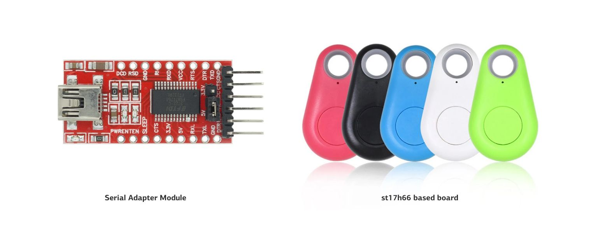
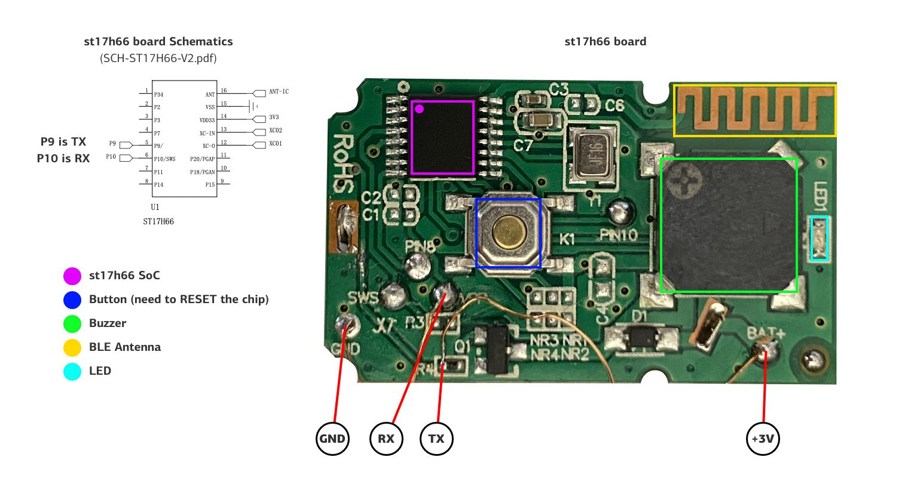
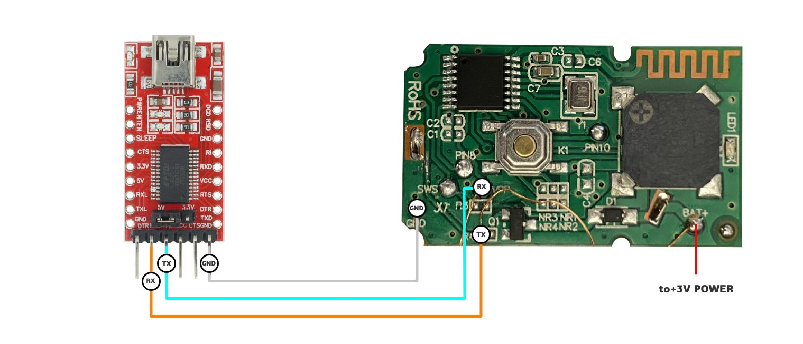
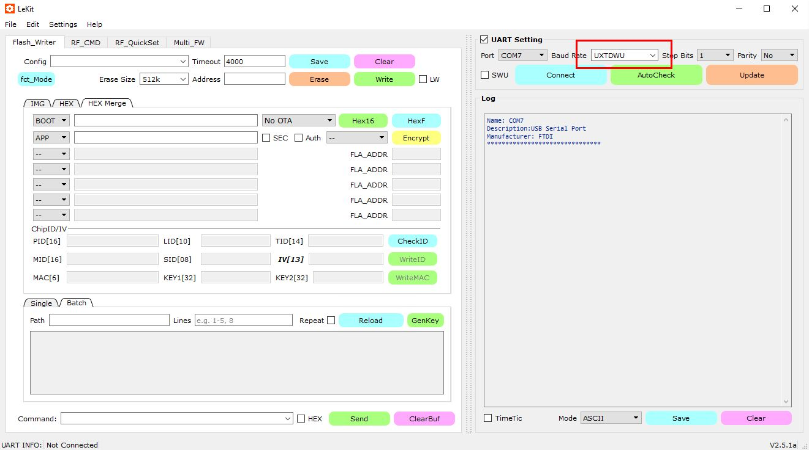
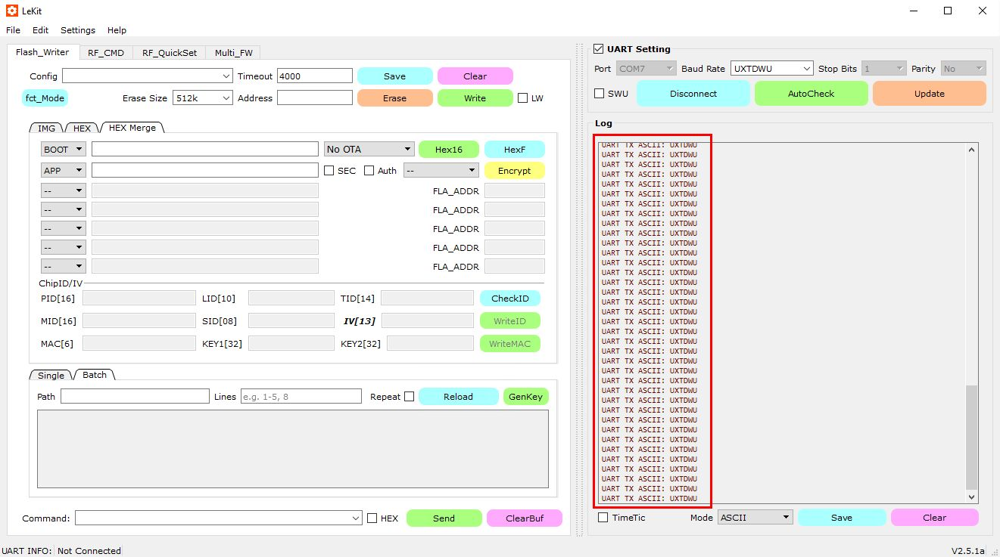
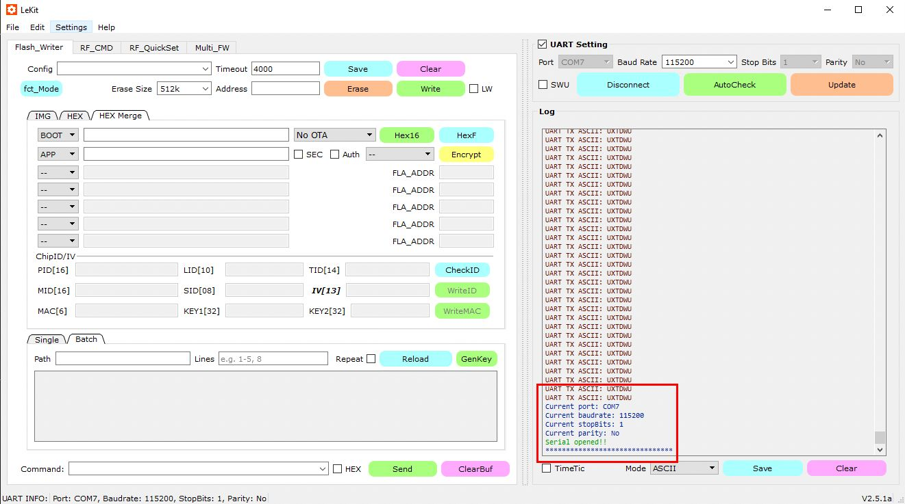
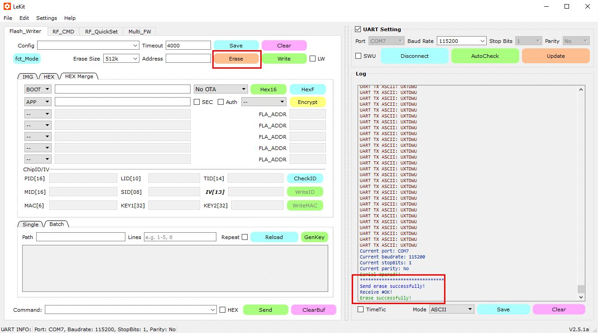
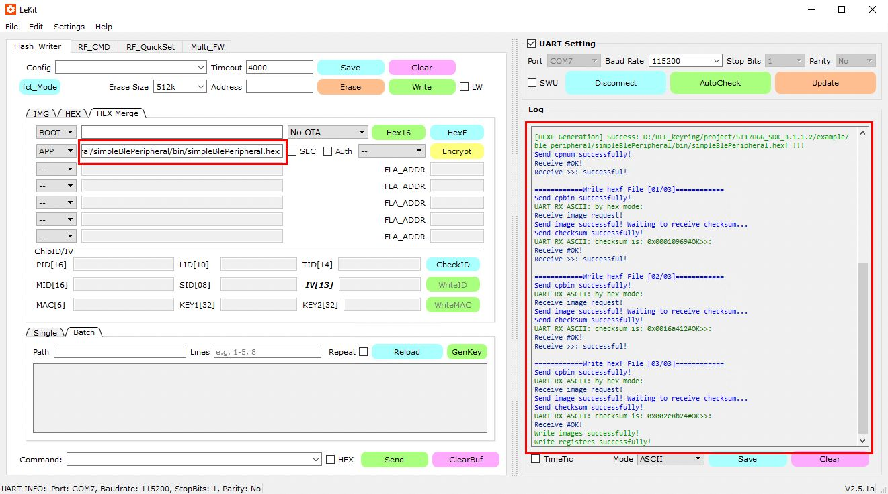

# How to flash st17h66

This is a basic instruction for flashing st17h66 on Windows using Lense LeKit software.

### What you'll need

For Serial adapter I use `FT232RL FTDI USB 3.3V 5.5V to TTL Serial Adapter Module`. The st17h66 based `Anti-lost Keychain Finder Device` sold on Aliexpress started from 1.50€. I bought [this](https://www.aliexpress.com/item/1005003357986346.html) item, but keep in mind that for this kind of devices sellers usually don't write what SoC inside, and there is no any guarantee that you'll get exactly an item with st17h66 inside.

Lense provides a PDF (Chinese) with the flash instructions ([docs/ST17H66_flashing.pdf](../docs/ST17H66_flashing.pdf)) using their dev kit. From this doc we can figure out what pins are for `Tx` and `Rx` and how to use LeKit software. 

### The board connections

There are some test pads on the board, that make it easy to connect the stuff, except `TX`. This pin comes from the SoC  `PIN5` thru the via on `R4`, which is the best place to solder a wire. The button on this board connected to `P15`, and act as `RESET` state trigger. 

### Flash process

1. Make sure that SoC has separate 3v power. During the RESET state board consumes around 130mA, and some USB UART can't provide enough power to properly feed the board.

2. Disconnect power or battery from the st17h66 board. 

3. Connect Serial adapter to the board acording schematics.

   

   

4. Launch LeKit. Connect UART adapter, choose option `UXTDWU` in baud rate dropdown and press Connect button.

   

5. Software start to transmit `UXTDWU` message to serial port. You may hear that Buzzer on the board starts ticking.

   
   
   

6. Press and hold the `RESET` button (or PULL HIGH `P15`) on the board and connect the board to +3v power. If SoC enters RESET state, LeKit will stop transmit `UXTDWU` packet and automatically switches the baud rate to 115200. You should see «Serial opened!!» message in the Log window.

   

   

7. Now that the SoC is in RESET state we are able to reflash it. Press the ERASE button to erase the chip. Log window should indicate the status.

   

   

8. Then choose your compiled firmware in the `HEX Merge` tab (double clicking the text area right to APP dropdown). And press WRITE button. If everything is fine, you should see «Write registers successfully!» message.

   

   

9. Restart the board by disconnecting it from the 3v power, and connect it again.

Flashing is done.

If everything went correct, you should see messages appears on Log window, indicating that the board sending something to UART. 
